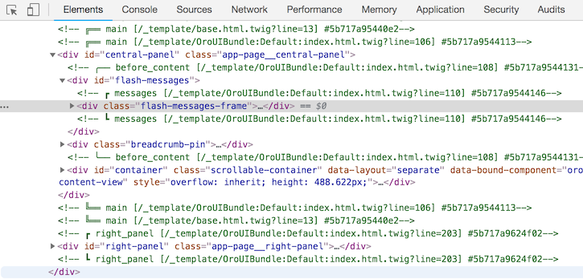
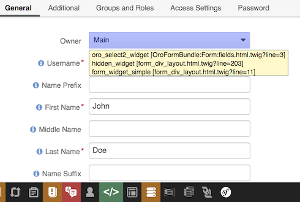
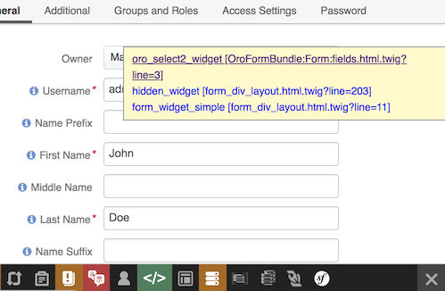
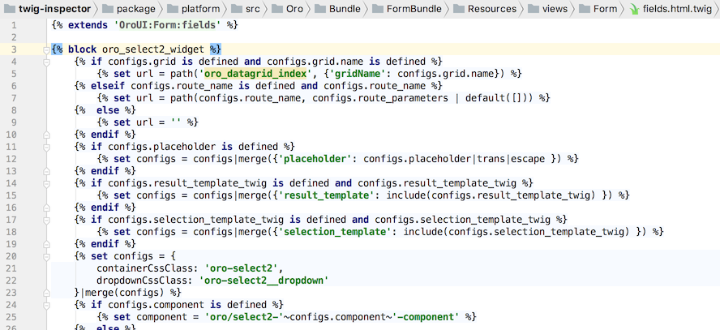

# How to Use Twig Inspector?

## Inspect with built-in Dev Tools in a Browser
The bundle adds HTML comments to the source of rendered HTML at the start and the end of Twig blocks and templates: 

**Note:** Different line types in the comment prefix are used to distinguish the start and the end of the comment for different blocks if there are many of them on a page.

It is recommended to view generated comments in the Browser Dev Tools in the "Elements" tab of Webkit based browsers (Chrome, Safari, Opera etc.) or in the "Inspector" tab in the Firefox because comments in tabs are well formatted.

It is not recommended to use the source code view because comments there are not readable enough.

## Inspect with Symfony Web Profiler Toolbar
The bundle also comes with an extension for **Symfony Web Profiler** that helps to debug visible blocks and navigate to the source code of the templates in your IDE or browser.

The extension is disabled by default to avoid affecting page rendering. 
It uses cookies to remember is it enabled on a page reload.

### Using Twig Inspector Toolbar Extension

1. In a Web Profiler Toolbar hover over the icon `</>` 

2. Select the enable checkbox. This reloads the page and adds comments to the page source code.
The icon has an orange background when enabled.
3. Click on the `</>` icon again. The icon goes green.
4. Hover over the element that you want to inspect on the webpage.  
The element you are hovering will be highlighted with the transparent blue overlay. 
n addition, the element contains a hint with block and template names used for rendering the hovered html. 

5. Click on the selected element.
When only one block or template is used for rendering, you are redirected to the IDE.
When multiple blocks and templates are used, a popup is displayed with links to them.
Click on the selected template to open it. 

6.The template opens in your IDE 

 
 To inspect elements that are not visible on a webpage (e..g. hidden or elements from the `header` section), 
 [Inspect the page with built-in Dev Tools in a Browser](#inspect-with-built-in-dev-tools-in-a-browser) 
